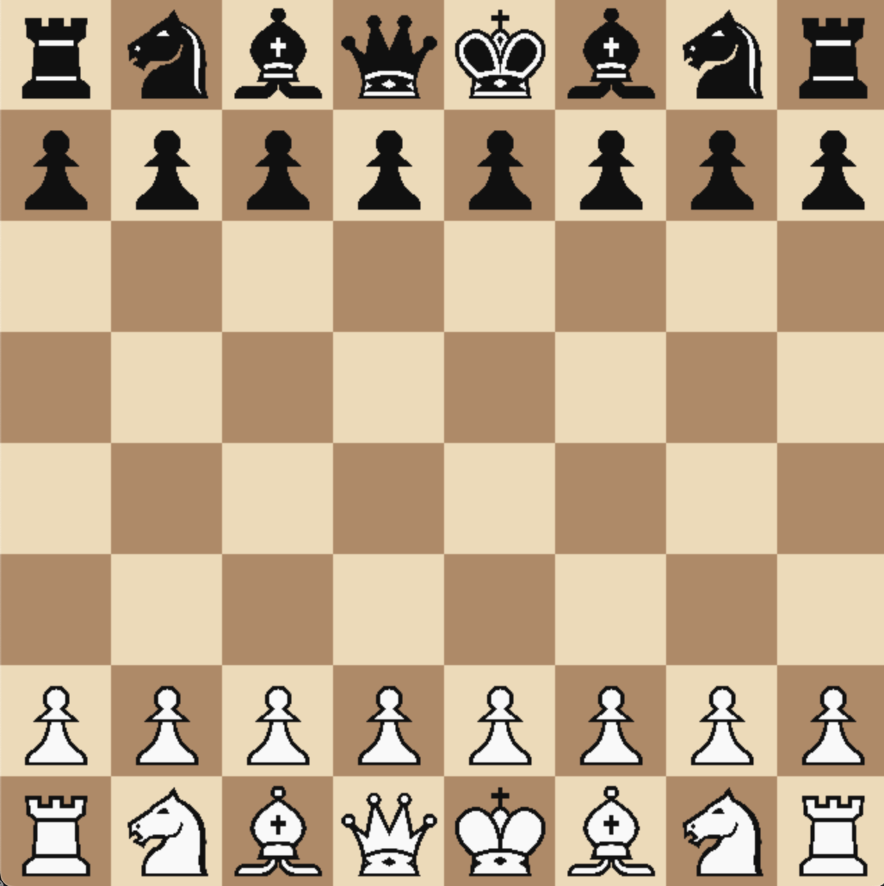

# chessy

this is my first big public project on github i was inspired by this video https://www.youtube.com/watch?v=U4ogK0MIzqk to make something similar i want to make a chess engine with python ui and c++ for logic 
and i thought it's a good opportunity to publish it on github publicly so i made a simple ui with pygame for start and im currently working on c++ part

---

## 🔧 Features

- [ ] Fast c++ engine
- [x] Highlight legal moves
- [x] simple **Python + Pygame** GUI
- [x] Legal move generation & validation (via `python-chess`)
- [x] Highlighting for selected pieces and legal moves
- [x] Clean visual design with piece images

---

## 📷 Preview

---

### 🔨 Requirements

- Python 3.8+
- C++ compiler (e.g., g++, clang)
- `pygame`
- `python-chess` 

